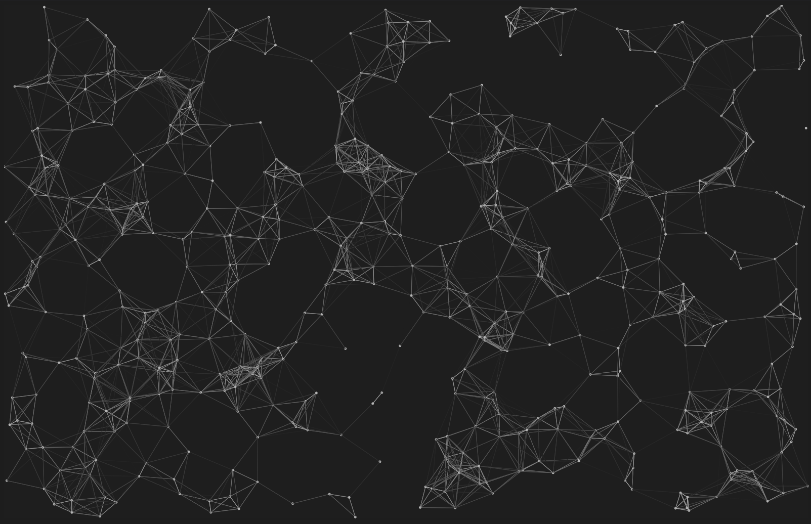
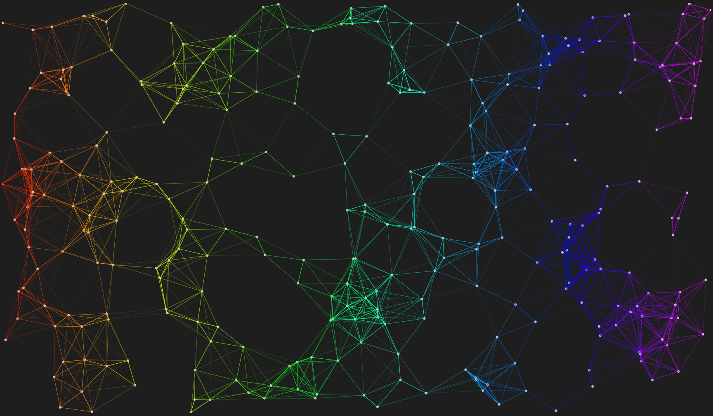

# Plexus
Plexus effect made using p5.js.

Learn how to make it [here](https://node-security.com/posts/building-a-plexus/).

View live demos:  
 - [Demo 1](https://o1dmate.github.io/Plexus/)  
 - [Demo 2](https://o1dmate.github.io/Plexus/#1)  
 - [Demo 3](https://o1dmate.github.io/Plexus/#2)  
 - [Demo 4](https://o1dmate.github.io/Plexus/#3)  